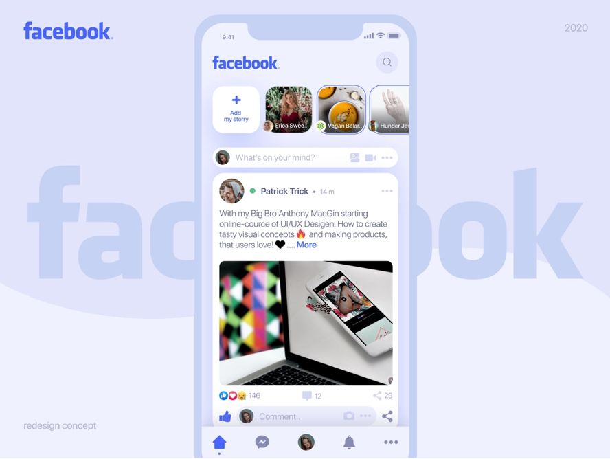
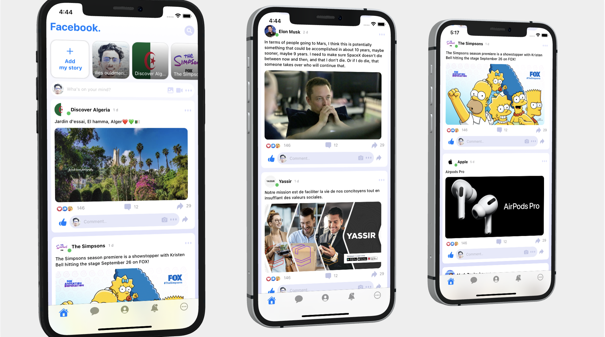

# Facebook mobile redesign IOS

Building Facebook UI redesign concept using SwiftUi. 🔥

Design by : [Lilya Vysotskaja](https://dribbble.com/shots/11374061-Facebook-mobile-redesign-main-page)

## App screenshots

Code by : [ilies ould menouer](https://www.linkedin.com/in/ilies-ouldmenouer-6a02111a2/)

### Progress :

- Home Screen ✅
- Messages Screen
- Notifications Screen
- Profile Screen

## Contributing

> This is an open source project , you can clone it and use it for your own purpose , and contribution are welcome

Show some ❤️ and star the repo to support the project
